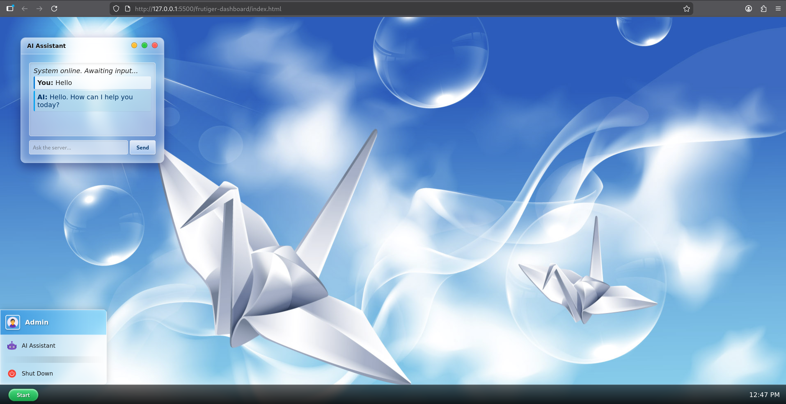

# 🌐 Frutiger Aero Web OS Dashboard


A fully functional, nostalgic web-based desktop environment inspired by the classic **Frutiger Aero** aesthetic of the late 2000s. This project combines retro UI/UX design (Glassmorphism) with modern asynchronous JavaScript and AI API integrations.

## 📸 Preview


## ✨ Key Features

* **🤖 Integrated AI Assistant:** A real-time chat interface connected to a powerful LLM (Groq / Llama 3) via an **n8n webhook** backend.
* **🪟 Advanced Window Management:** Fully draggable, minimizable, and maximizable application windows built with Vanilla JavaScript (no external UI libraries).
* **🔮 Authentic Glassmorphism:** CSS3 backdrops and complex drop-shadows replicating the iconic Windows Vista/7 Aero glass look.
* **🖱️ Interactive OS Elements:** A functional Start Menu with dropdown capabilities, click-outside-to-close logic, and dynamic system shutdown simulation.
* **⏱️ Real-Time Clock & Audio:** Dynamic taskbar clock and an integrated ambient audio engine for full immersion.

## 🛠️ Tech Stack

* **Frontend:** HTML5, Custom CSS3, Vanilla JavaScript (ES6+).
* **Backend / Middleware:** n8n (Workflow Automation) handling HTTP requests and payload parsing.
* **AI Provider:** Groq Cloud API (Llama 3.3 70B model).

Since this project relies on Vanilla web technologies, setup is straightforward. No local server, npm installations, or build tools are required.

1. **Clone this repository:**
```bash
git clone https://github.com/nickomega84/frutiger-dashboard.git
```

2. **Navigate to the project directory:**
```bash
cd "C:/Documents/Web Projects/frutiger-dashboard"
```

3. **Launch the OS:**
Simply locate and open the `index.html` file in your preferred modern web browser (Chrome, Firefox, Edge, etc.) to start the Frutiger Aero experience.
